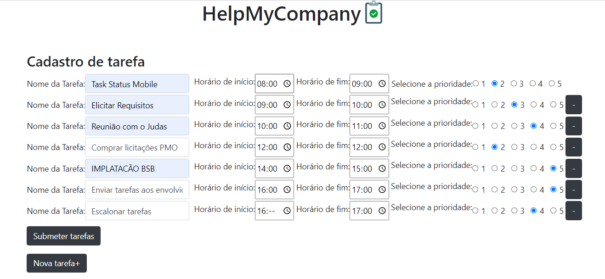

**Greed_HelpMyCompany.** 

Temas:
 - Greed
 
# HelpMyCompany

**Trabalho**: Greed<br>
**Conteúdo da Disciplina**: Greed (Algoritmos ambiciosos)<br>

## Alunos
|Matrícula | Aluno |
| -- | -- |
| 18/0024868 |  Mateus Moreira Lima |
| 19/0044390 |  Victor Rayan Adriano Ferreira |

## Sobre 
Nosso trabalho utiliza o algoritmo ambicioso Weighted Interval Scheduling O(nlog(n)) para montar a melhor lista de tarefas à ser realizada por uma empresa, com isso a empresa pode definir as tarefas e suas prioridades, e o nosso algoritmo provê as tarefas/atividade mais lucrativas caso elas tenham choque de horário.

## Screenshots
Tela Inicial de cadastro das tarefas.


Tela com algumas validações.


Tela com as tarefas priorizadas.


## Instalação 
**Linguagem**: Python 3 <br>
**Frameworks**: Django e Bootstrap5<br>

Para rodar a aplicação é necessário ter instalado em sua máquina o python 3 e o Django.

### Rode o comando a seguir para instalar as dependências:
```
$ pip install -r requirements.txt
```
ou
```
$ pip3 install -r requirements.txt
```

### Para rodar a aplicação:

Para entrar dentro da pasta Mapfinder

```
$ python manage.py runserver
```
ou
```
$ python3 manage.py runserver
```

### Acessar a url:
```
$ http://127.0.0.1:8000/home/
```


## Uso 
Explique como usar seu projeto caso haja algum passo a passo após o comando de execução.


